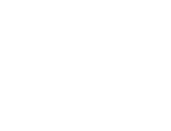
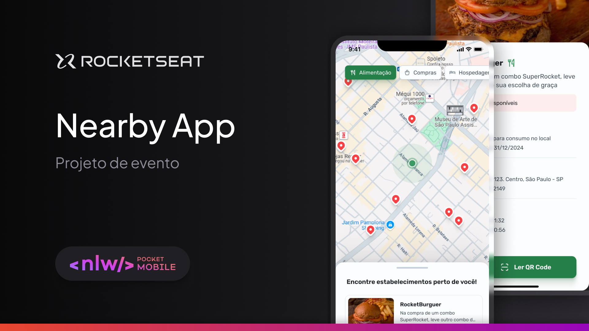
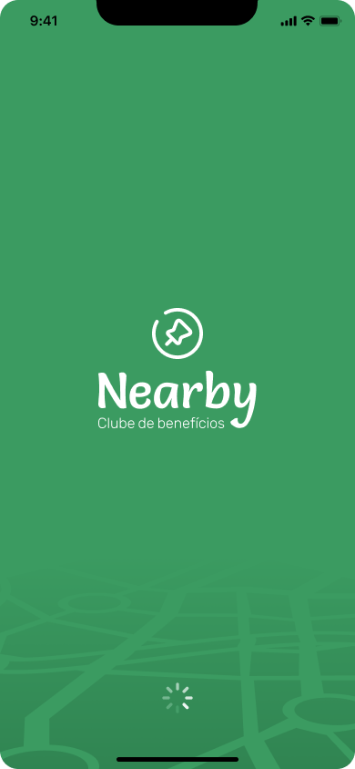
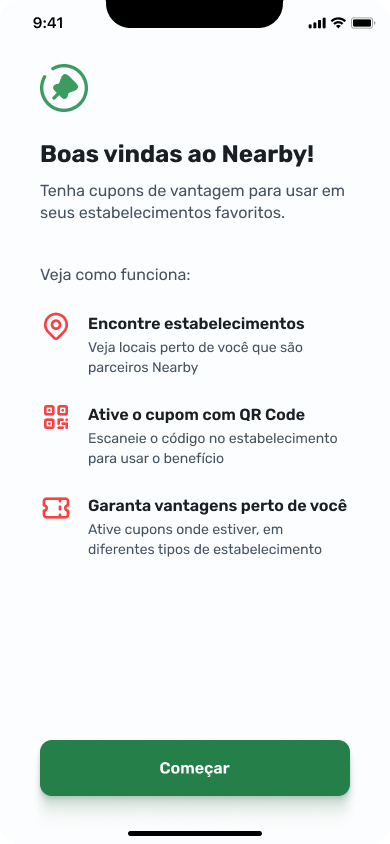
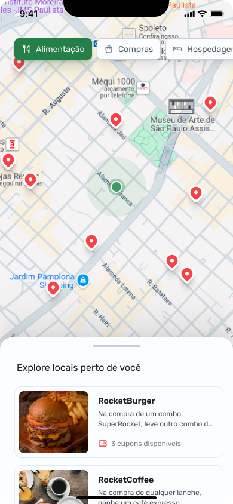
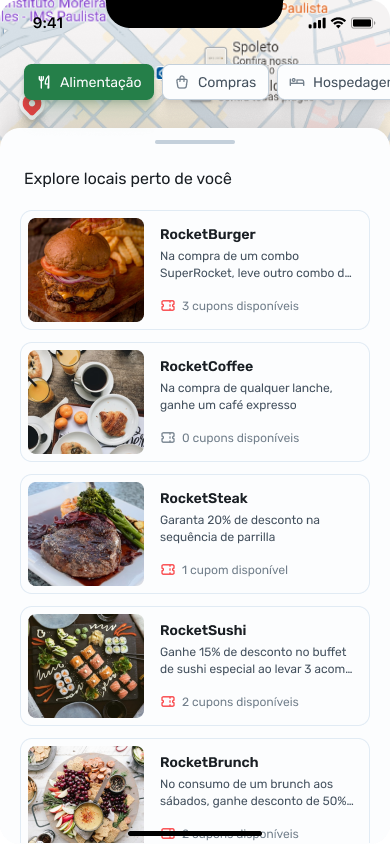
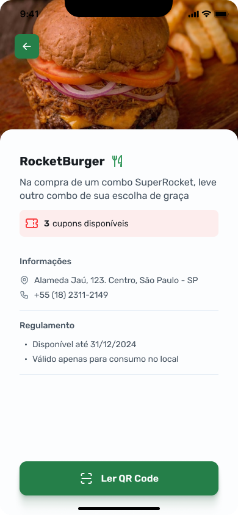
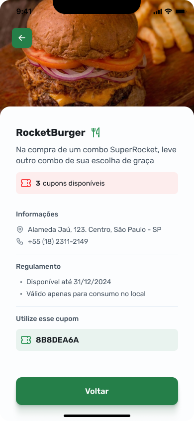

<h1 align="center">
  
</h1>

<p align="center">
  
</p>

<h4 align="center"> 
	🚀 Aplicação finalizada 🚀
</h4>

<p align="center">
 <a href="#-about">Sobre</a> | 
 <a href="#-layout">Layout</a> | 
 <a href="#-setup">Configuração</a> | 
 <a href="#-technologies">Tecnologias</a> | 
 <a href="#-license">Licença</a>
</p>

---

## 💻 Sobre

O **Nearby** é um aplicativo mobile de clube de benefícios que permite resgatar cupons para utilização em estabelecimentos próximos a você.

### Funcionalidades principais:
- Uso de mapas no React Native;
- Implementação de um componente de Bottom Sheet;
- Leitura de QR Code para resgate de cupons.

Essa aplicação foi desenvolvida durante o **NLW Pocket Mobile** da [Rocketseat](https://www.rocketseat.com.br/), utilizando tecnologias como **React Native**, **Expo** e **TypeScript**.

---

## 🎨 Layout

Você pode visualizar o layout completo do projeto através [deste link no Figma](https://www.figma.com/community/file/1448070647757721748). É necessário possuir uma conta no [Figma](https://www.figma.com/) para acessá-lo.

### Demonstração das telas principais:

<p align="center">
  
  
  
  
  
  
</p>

---

## ⚙ Configuração

### 📝 Pré-requisitos

Antes de iniciar, certifique-se de ter instalados em sua máquina:
- [Git](https://git-scm.com)
- [Node.js](https://nodejs.org/en/)
- [NPM](https://www.npmjs.com/) ou [Yarn](https://yarnpkg.com/)

Para acessar os dados necessários, você também precisará clonar o repositório da [API back-end](https://github.com/uillasnr/Nearby-App/tree/master/mobile-api) e executá-lo em sua máquina.

### 📦 Como rodar o projeto

Siga os passos abaixo para clonar e executar o projeto:

```bash
# Clone este repositório
$ git clone https://github.com/uillasnr/Nearby-App.git

# Acesse a pasta do projeto mobile
$ cd Nearby-App/mobile

# Instale as dependências do front-end
$ npm install

# Inicie o servidor da API back-end
$ cd ../api
$ npm install
$ npm run start

# Execute o aplicativo mobile
$ cd ../mobile
$ npm run start

```


## 🛠 Technologies

As principais ferramentas utilizadas no desenvolvimento do projeto incluem:

- **[React Native](https://reactnative.dev/)**
- **[Expo](https://expo.dev/)**
- **[TypeScript](https://www.typescriptlang.org/)**
- **[Table Icons](https://tabler.io/docs/icons/react-native)**
- **[Axios](https://axios-http.com/ptbr/docs/intro)**
- **[Bottom Sheet](https://github.com/gorhom/react-native-bottom-sheet)**
- **[React Native Maps](https://docs.expo.dev/versions/latest/sdk/map-view/)**
- **[Expo Camera](https://docs.expo.dev/versions/latest/sdk/camera/)**

> Para mais detalhes das dependências gerais da aplicação veja o arquivo [package.json](./mobile/package.json)


## 📝 License

Este projeto está sob a licença MIT. Consulte o arquivo [LICENSE](./LICENSE) para mais informações

##  Autor

<a href="https://github.com/uillasnr">
  
  <br />
  <sub>
    <strong>Uillas nascimento reis</strong>
  </sub>
</a>

Feito por Uillas  Entre em contato!


[](https://www.linkedin.com/in/uillasnr)
[](wiliasreis@hotmail.com)
[](https://wa.me/5511991654732)
